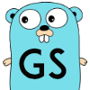

<p align="center">
    <a href="https://github.com/jotcodeofficial/go-session">
        
    </a>
 <h2 align="center">Go Session</h2>
 <p align="center">Customisable Multi-Session Framework For Golang</p>
</p>
  <p align="center">
    <a href="https://github.com/jotcodeofficial/go-session/network/members">
      
    </a>
    <a href="https://github.com/jotcodeofficial/go-session/stargazers">
      
    </a>
    <a href="https://twitter.com/intent/follow?screen_name=jotc0de" target="_blank">
      
    </a>
    <br />
    <br />
    <a href="https://blog.jotcode.com" target="_blank">
      
    </a>
    <a href="https://jotcode.com" target="_blank">
      
    </a>
    
  </p>

  <p align="center">
    <a href="https://github.com/jotcodeofficial/go-session/issues/new/choose">Report Bug</a>
    -
    <a href="https://github.com/jotcodeofficial/go-session/issues/new/choose">Request Feature</a>
  </p>

# Index

<!-- TABLE OF CONTENTS -->
<details closed="closed">
  <summary>Table of Contents</summary>
  <ol>
    <li>
      <a href="#about-the-project">About The Project</a>
      <ul>
        <li><a href="#built-with">Built With</a></li>
      </ul>
    </li>
    <li>
      <a href="#getting-started">Getting Started</a>
      <ul>
        <li><a href="#prerequisites">Prerequisites</a></li>
        <li><a href="#installation">Installation</a></li>
      </ul>
    </li>
    <li>
      <a href="#roadmap">Roadmap</a>
      <ul>
        <li><a href="#stage-1">Stage 1</a></li>
        <li><a href="#stage-2">Stage 2</a></li>
        <li><a href="#stage-3">Stage 3</a></li>
      </ul>
    </li>
    <li><a href="#contributing">Contributing</a></li>
    <li><a href="#license">License</a></li>
    <li><a href="#contact">Contact</a></li>
    <li><a href="#support-the-project-sparkling_heart">Support the Project</a></li>
  </ol>
</details>


## About The Project

<p align="center">
    <a href="https://github.com/jotcodeofficial/go-session">
        
    </a>
 <h2 align="center">Go Session</h2>
 <p align="center">Customisable Multi-Session Framework For Golang</p>
</p>

Most session based frameworks are JWT which aren't easily revocable and you can't really limit the amount of sessions without a backend cache.

With go-session you will have an entire framework for user registration and session management control.

I built it to integrate with mongo and redis micro-services. You can try it out on localhost for development purposes, with the added docker containers in the localhost folder. (Just follow the instructions in the README files)

Some features:
* User sign up with email confirmation and reset/forgot password integration.
* Max sessions per user account. (Limit device count - better than JWT).
* Extra functionality such as user posts and custom filters.

Build your project by forking this repo right now! :smile:

---

### Built With

In this area you can list the different libraries and technologies that your project uses.
* [Golang](https://golang.org)
* [Redis](https://redis.io/)
* [MongoDB](https://www.mongodb.com/)


## Getting Started

Ensure you search and update all text that contains 'domain' with your own domain/brand name.
Also add *.env to the .gitignore file when you change the default values.

### Prerequisites

This section should show what software is required before you can proceed with the installation.
* [Golang](https://golang.org)
* [Redis](https://redis.io/)
* [MongoDB](https://www.mongodb.com/)
* [Docker](https://www.docker.com/)


### Installation

Follow these instructions to get your test environment set up.

1. Clone the repo
   ```sh
   git clone https://github.com/jotcodeofficial/gosession.git
   ```
3. Install Go packages
   ```sh
   go get ./
   ```
4. Run local mongo & redis containers
   ```sh
   Use commands in go-session/localhost/startup-all/startup.txt(or change the extension to turn it into a bash script depending on your os)
   ```

## Contributing

Great things are a sum of their parts. By contributing your time and effort you can help make this project even better. Collaborative efforts ftw.


## License

Released under the MIT License.


## Contact

[@jotc0de](https://twitter.com/jotc0de)

contact@jotcode.com


## Support the Project :sparkling_heart:

If you are not a coder you can still help support the project by sharing it far and wide.
Thanks! :heart:
